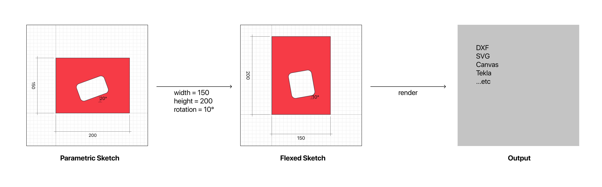

# Introduction to JSDraft

JSDraft is a tool for creating 2D parametric drawings which can be flexed at runtime and output to a range of potential outputs (i.e., SVG, DXF, etc).



## Sketch

A "sketch" is the core data structure that represents a drawing. It uses "feature" functions to clone this data structure and return new, modified sketches:

```js
import { Sketch, render } from '@crhio/jsdraft';

const sketch = new Sketch()
  .rectangle([0, 0], 25, 10)
  .circle([0, 0], 20);

// "render" can convert a sketch to an SVG string
const svg = render(sketch, 'svg');
```

## Sketch feature functions

A sketch "feature" is a function that takes a sketch and a set of parameters as arguments, and returns a new sketch:

```js
function square(sketch, width) {
  const min = -width / 2;
  const max = width / 2;

  return sketch
    .rectangle(min, min, max, max);
}
```

Parametric drawings in JSDraft are simply feature functions. Drawings can be created by composing any of the [built-in feature functions](api.md). User-defined features can also be registered with a Sketch and used by other features; this allows drawings to be constructed in a modular fashion:

```js
// Create a new base sketch
const sketch = new Sketch();

// Add the user-defined "square" feature to the sketch
sketch.inject(square);

// Use the user-defined feature to create a new sketch
const drawing = sketch.user.square(20);

// resulting drawing will contain a square of width 20
const svg = render(drawing, 'svg');
```

## Entities

A feature can add "entities" to a sketch. Entities are the geometric and annotation primitives that can be drawn, and include:

* Point
* Segment
* Arc
* Polycurve
* Polyface
* Text
* AlignedDim
* DimString
* Leader
...etc

There are [built-in features](api.md) for all of these primitive entities, which can be combined in user-defined features to create more complex drawings.

The last entity added to a sketch can be retrieved with the `.shape` getter:
```js
const sketch = new Sketch()
  .point(1, 2);

const point = sketch.shape;
// Point { x: 1, y: 2 }
```

All of the entities in a sketch can be retrieved with the `.entities` getter:
```js
const sketch = new Sketch()
  .point(1, 2)
  .circle([0, 0], 20)
  .rectangle([10, 10], 10, 5);

const entities = sketch.entities;
// [
//   Point { x: 1, y: 2},
//   Circle { pc: { x: 0, y: 0 }, r: 20 },
//   Rectangle { xmin: 10, ymin: 10, xmax: 20, ymax: 15 },
// ]
```

## Draft

A "draft" is a collection of sketch features, stored as raw strings. Features can be defined in either a [YAML-based syntax](yaml-syntax.md) or in [JavaScript](js-syntax.md).

All features in a draft "file" are automatically registered so that they can be used by any of the other features. When stored on disk, a draft "file" is actually just a folder, which by convention has a ".draft" extension; all sketch features contained within this folder should follow the naming pattern `name.js` or `name.yaml`. Draft files should also have an `index.json`, which is used to define settings and properties that apply to the entire collection.

The draft file can then be imported and used within a project:

```js
import draft from 'path/to/file.draft';

// render one of the features within the draft file
const svg = draft.render(
  'feature', // name of the feature to be rendered
  [],        // arguments that the feature can accept
  'svg',     // output format
  {},        // rendering options
);
```
